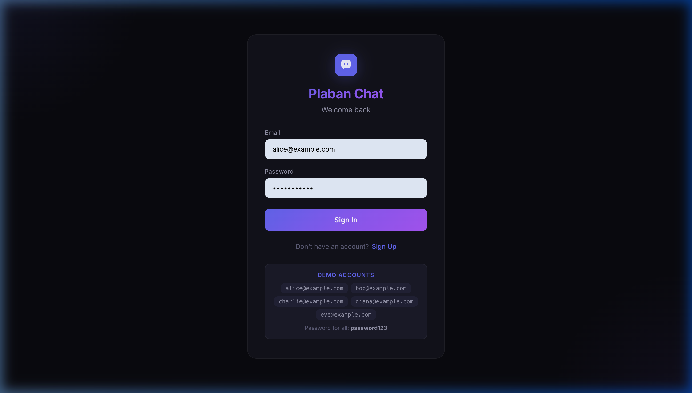
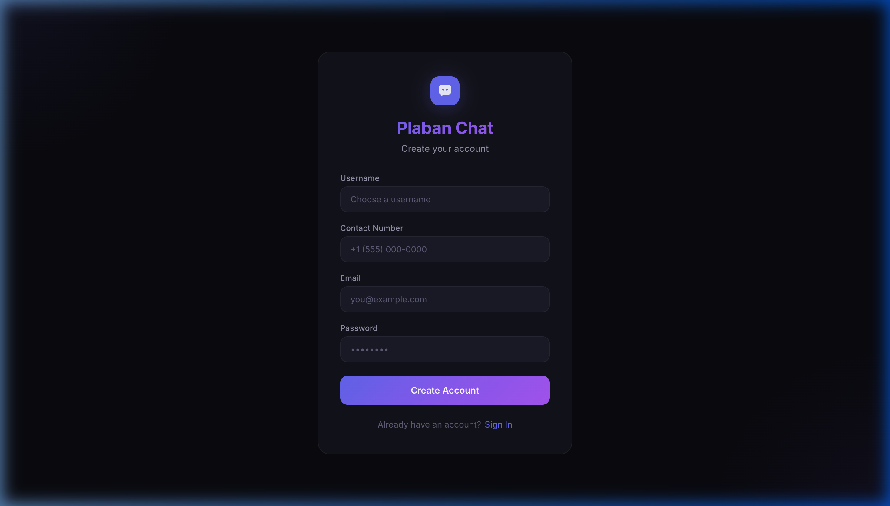
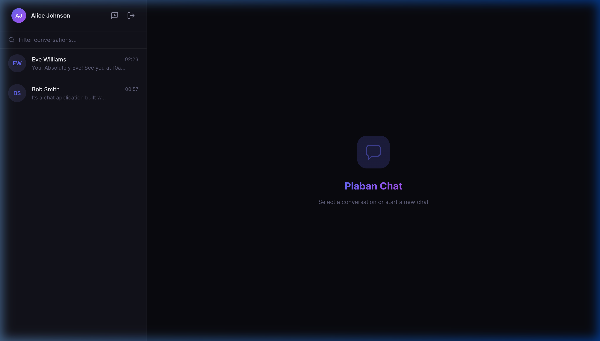
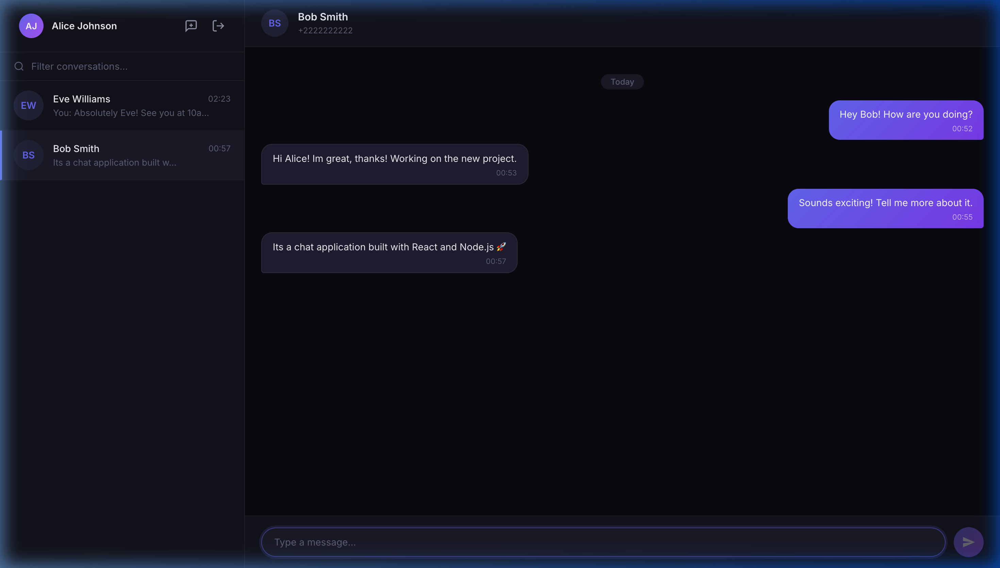

<div align="center">

  

  <h1>💬 Plaban Chat Application</h1>

  <p>
    A <strong>real-time, full-stack chat application</strong> built with React, Node.js, Express, Socket.IO, and SQLite.
    Features two-way live messaging, user search by phone number, profile management, and a fully responsive mobile-friendly UI.
  </p>

  <p>
    
    
    
    
    
  </p>

</div>

---

## 📸 Screenshots

### 🔐 Sign In


### 📝 Sign Up


### 🏠 Chat Dashboard


### 💬 Live Chat Interface


---

## ✨ Features

### 🔴 Real-Time Two-Way Messaging
- Messages are delivered **instantly** to both users using **Socket.IO WebSockets**
- No page refresh needed — the chat updates live as both parties send messages
- A 10-second polling fallback ensures messages are never missed even if a socket event is dropped

### 🔍 Search Users by Contact Number
- Tap the **"New Chat"** button (+) in the sidebar
- Type any part of a phone number (e.g., `+3333`) to search
- The matching user's **name and number** appear in a dropdown
- Click the result to **instantly add them to your chat list** and open the conversation

### 👤 Profile Management
- View your username, email, and contact number in a slide-out profile panel
- **Edit any field** and save changes directly to the backend
- **Upload a custom profile picture** — shown as an avatar throughout the app

### 🔐 Authentication
- **Sign Up** with username, email, password, and contact number
- **Sign In** with email + password
- Session token stored in `localStorage` — you stay logged in across page reloads
- Secure token-based API authentication (`Bearer` token on every request)

### 📱 Fully Responsive (Mobile-Friendly)
- **Mobile-first layout**: sidebar slides in/out as a full-screen overlay on small screens
- A **back button** in the chat header navigates from the chat back to the sidebar
- Responsive breakpoints at **768px**, **480px**, and **360px**
- Touch-friendly input sizes and paddings throughout

### 🟢 Online Status Indicators
- Green dot badge appears next to users who are **currently online**
- The chat header shows "Online" instead of the contact number when the partner is active

### 🌑 Premium Dark UI
- Deep dark theme with an **indigo/violet gradient accent palette**
- **Glassmorphism-inspired** card surfaces with subtle borders
- Smooth micro-animations on messages, modals, and hover states
- Custom scrollbars, date separators in chat, and gradient send button

---

## 🏗️ Architecture

```
┌────────────────────────────────────┐     ┌──────────────────────────────────┐
│          React Frontend            │     │        Node.js Backend           │
│  (Vite · port 5173 in dev)         │────▶│  (Express · port 3001)           │
│                                    │     │                                  │
│  src/                              │◀────│  REST API  /api/*                │
│  ├── App.jsx          (root)       │     │  Socket.IO  (real-time events)   │
│  ├── components/                   │     │  SQLite     (persistent chat.db) │
│  │   ├── Auth.jsx     (login)      │     └──────────────────────────────────┘
│  │   ├── Chat.jsx     (main UI)    │
│  │   └── Profile.jsx  (panel)      │
│  └── utils/                        │
│      ├── api.js       (REST client)│
│      └── socket.js    (WS client)  │
└────────────────────────────────────┘
```

### Data Flow

1. **User signs in** → frontend receives a session token → stored in `localStorage`
2. **Socket.IO connection** is established → user joins their personal room
3. **Sending a message** → REST `POST /api/messages` saves it to SQLite → backend emits `new_message` socket event to recipient
4. **Receiving a message** → Socket.IO listener in `Chat.jsx` appends it to the message list in real-time
5. **Searching a user** → debounced `GET /api/users/search?q=<number>` → results shown in dropdown

---

## 🗂️ Project Structure

```
Plaban Chat Application/
│
├── 📁 public/                  # Static assets
│
├── 📁 screenshots/             # App screenshots for README
│
├── 📁 server/                  # Node.js backend
│   ├── index.js                # Express server, Socket.IO, SQLite, all API routes
│   ├── package.json            # Backend dependencies
│   └── .env                   # Backend environment variables
│
├── 📁 src/                     # React frontend
│   ├── App.jsx                 # Root component — auth state + socket lifecycle
│   ├── main.jsx                # React entry point
│   ├── index.css               # Global dark-theme design system
│   ├── 📁 components/
│   │   ├── Auth.jsx            # Sign In / Sign Up screens
│   │   ├── Chat.jsx            # Main chat interface (sidebar + messages)
│   │   └── Profile.jsx         # Profile slide-out panel
│   └── 📁 utils/
│       ├── api.js              # REST API client (all fetch calls)
│       └── socket.js           # Socket.IO client manager
│
├── .env                        # Frontend environment variables (VITE_BACKEND_URL)
├── .gitignore
├── index.html
├── package.json                # Frontend dependencies
└── vite.config.js              # Vite config + dev server proxy
```

---

## 🚀 Getting Started

### Prerequisites

- **Node.js** v18 or higher
- **npm** v9 or higher

### 1. Clone the Repository

```bash
git clone https://github.com/your-username/plaban-chat-application.git
cd plaban-chat-application
```

### 2. Install Frontend Dependencies

```bash
npm install
```

### 3. Install Backend Dependencies

```bash
cd server && npm install && cd ..
```

### 4. Configure Environment Variables

**Frontend** — edit `.env` in the root:
```env
# For local development
VITE_BACKEND_URL=http://localhost:3001

# For production (replace with your deployed backend URL)
# VITE_BACKEND_URL=https://your-backend-app.onrender.com
```

**Backend** — edit `server/.env`:
```env
PORT=3001
ALLOWED_ORIGINS=http://localhost:5173,https://your-frontend-app.vercel.app
```

### 5. Run the App

Open **two terminals**:

```bash
# Terminal 1 — Start backend
cd server
node index.js
```

```bash
# Terminal 2 — Start frontend
npm run dev
```

Visit **http://localhost:5173** in your browser.

---

## 🧪 Demo Accounts

The database is automatically seeded with 5 test users on first run. Use any of them to test the app:

| Name | Email | Password | Contact Number |
|---|---|---|---|
| Alice Johnson | alice@example.com | `password123` | +1111111111 |
| Bob Smith | bob@example.com | `password123` | +2222222222 |
| Charlie Brown | charlie@example.com | `password123` | +3333333333 |
| Diana Prince | diana@example.com | `password123` | +4444444444 |
| Eve Williams | eve@example.com | `password123` | +5555555555 |

> **Tip for testing two-way chat:** Open two browser windows side by side. Sign in as Alice in one and Bob in the other. Search for each other by number and start chatting — messages will appear in real-time on both screens!

---

## 🌐 API Reference

All endpoints are prefixed with `/api` and require an `Authorization: Bearer <token>` header (except auth routes).

| Method | Endpoint | Description |
|---|---|---|
| `POST` | `/api/auth/signup` | Register a new user |
| `POST` | `/api/auth/signin` | Sign in → returns `{ user, token }` |
| `GET` | `/api/users/search?q=` | Search users by contact number |
| `GET` | `/api/users/profile` | Get current user's profile |
| `PUT` | `/api/users/profile` | Update profile (username, email, contact, picture) |
| `GET` | `/api/chats` | List all conversations with last message |
| `GET` | `/api/messages/:partnerId` | Get full message history with a user |
| `POST` | `/api/messages` | Send a message `{ recipientId, text }` |
| `POST` | `/api/conversations` | Add a user to your chat list `{ partnerId }` |

### Socket.IO Events

| Event | Direction | Payload | Description |
|---|---|---|---|
| `join` | Client → Server | `userId` | User joins their personal room |
| `new_message` | Server → Client | `{ id, senderId, text, timestamp }` | Incoming message notification |
| `user_online` | Server → Client | `userId` | A user came online |
| `user_offline` | Server → Client | `userId` | A user went offline |

---

## 🗄️ Database Schema

Built with **SQLite** (`better-sqlite3`) — stored in `server/chat.db`.

```sql
users         (id, username, email, password, contactNumber, profilePicture, createdAt)
messages      (id, senderId, recipientId, text, timestamp)
conversations (userId, partnerId, createdAt)
tokens        (token, userId, createdAt)
```

---

## 🛠️ Tech Stack

| Layer | Technology | Purpose |
|---|---|---|
| Frontend framework | **React 19** | Component-based UI |
| Build tool | **Vite 6** | Dev server, bundling, env vars |
| Styling | **Vanilla CSS** | Full custom dark design system |
| Real-time | **Socket.IO client** | WebSocket connection to backend |
| Backend runtime | **Node.js + Express** | REST API server |
| Real-time server | **Socket.IO server** | Broadcasting messages |
| Database | **SQLite (better-sqlite3)** | Persistent data storage |
| Auth | **Token-based (custom)** | Bearer token in `localStorage` |
| Environment | **dotenv** | `.env` file support in backend |
| Dev proxy | **Vite proxy** | Routes `/api` and `/socket.io` to backend in dev |

---

## ☁️ Deployment

### Frontend → Vercel

1. Push this repo to GitHub.
2. Import into [Vercel](https://vercel.com).
3. Set **Build Command**: `npm run build`
4. Set **Output Directory**: `dist`
5. Add Environment Variable:
   ```
   VITE_BACKEND_URL = https://your-backend-app.onrender.com
   ```

### Backend → Render

1. Create a new **Web Service** on [Render](https://render.com).
2. Set **Root Directory**: `server`
3. Set **Build Command**: `npm install`
4. Set **Start Command**: `node index.js`
5. Add Environment Variables:
   ```
   PORT = 3001
   ALLOWED_ORIGINS = https://your-frontend-app.vercel.app
   ```
6. Once deployed, copy the Render URL and update `VITE_BACKEND_URL` on Vercel and `ALLOWED_ORIGINS` in your `server/.env`.

> ⚠️ **Note on SQLite in Production:** SQLite's `chat.db` file is stored on the server's filesystem. On Render's free tier, the disk is **ephemeral** — the database resets on each deploy. For persistent production storage, consider upgrading to Render's persistent disk or migrating to a hosted database like PostgreSQL (PlanetScale, Supabase, Neon, etc.).

---

## 📄 License

This project is open source and available under the [MIT License](LICENSE).

---

<div align="center">
  Built with ❤️ using React · Node.js · Socket.IO · SQLite
</div>
